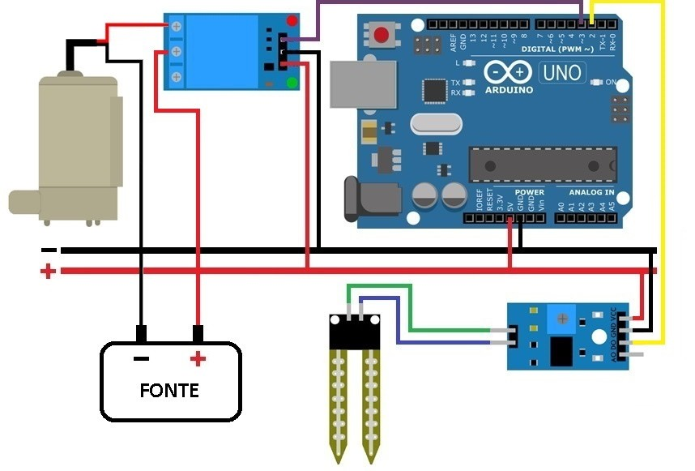

# Sistema de Irrigação Automatizado com Arduino

 

Projeto desenvolvido para a disciplina de **Sistemas Embarcados** ministrada pelo **Prof. Henrique Patriota**.  
**Alunos:** Marcel Gustavo e Mateus Omar.

---

## 🚀 Descrição do Projeto
Sistema embarcado para controle autônomo de irrigação, capaz de monitorar a umidade do solo e ativar/desativar uma bomba d'água conforme as condições detectadas. Desenvolvido com o microcontrolador ATmega328P (Arduino Uno), o projeto utiliza técnicas de  **interrupções por timer** e **controle direto de registradores** para otimizar desempenho.

---

## ⚙️ Funcionalidades
- **Leitura contínua da umidade do solo** via sensor capacitivo.
- **Ativação automática da bomba d'água** quando o solo está seco.
- **Indicação visual** com LEDs (vermelho para solo seco, verde para úmido).
- **Modo de baixo consumo** (SLEEP_MODE_IDLE) durante períodos de inatividade.
- **Histerese** para evitar oscilações no acionamento da bomba.

---

## 📋 Componentes Utilizados
| Componente               | Especificações                          | Quantidade |
|--------------------------|-----------------------------------------|------------|
| Arduino Uno              | ATmega328P, 16 MHz, 5V                 | 1          |
| Sensor de Umidade        | Capacitivo (saída digital/analógica)    | 1          |
| Módulo Relé 1 Canal      | 5VDC, 10A 250VAC                       | 1          |
| Bomba d'água DC          | 3-6VDC, 1.2A                           | 1          |
| LEDs                     | Vermelho e Verde (5mm)                  | 2          |
| Resistores               | 220Ω                                    | 2          |
| Suporte de Pilhas 4xAA   | 6VDC                                    | 1          |

---

## 🔧 Instalação
1. **Clonar o Repositório**:
   ``bash
   git clone https://https://github.com/marcelgs13/PROJETO-SISTEMA_DE_IRRIGACAO
   ``

2. **Configurar Ambiente**:
   - Arduino IDE 2.x ou PlatformIO

3. **Montagem do Hardware**:
   - Conectar componentes conforme o diagrama acima e adicionar os dois Leds.
   - Alimentar Arduino via USB e bomba via suporte de pilhas.

4. **Carregar Código**:
   - Abrir `código` na Arduino IDE.
   - Compilar e enviar para o Arduino Uno.

---

## 🎮 Uso
1. Ligue o Arduino via USB.
2. Insira o sensor de umidade no solo.
3. O sistema iniciará automaticamente:
   - **LED verde**: Solo úmido (bomba desligada).
   - **LED vermelho**: Solo seco (bomba ligada).

---

## 📄 Licença
Este projeto está sob licença MIT. Veja o arquivo [LICENSE](LICENSE) para detalhes.

---

## ✉️ Créditos
- **Orientador**: Prof. Henrique Patriota  
- **Desenvolvedores**: [Marcel Gustavo](https://github.com/marcel-gustavo) | [Mateus Omar]((https://github.com/M4T3U5123))
